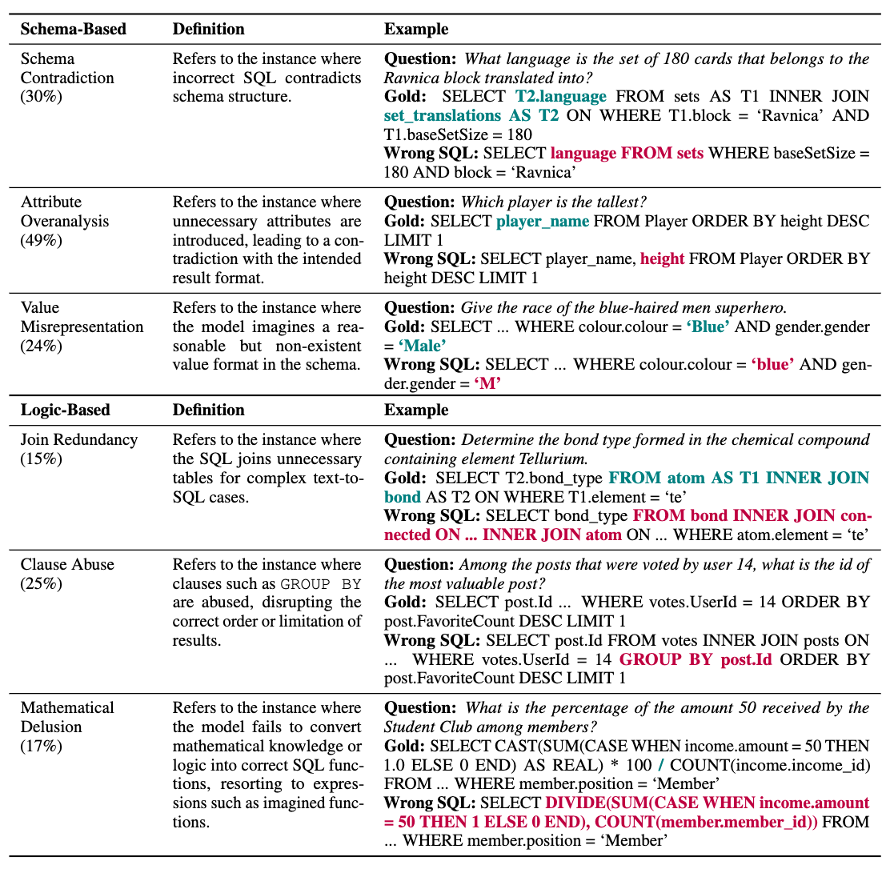

# Before Generation, Align it! A Novel and Effective Strategy for Mitigating Hallucinations in Text-to-SQL Generation

[](https://bird-bench.github.io/)
[](https://yale-lily.github.io/spider)
[](https://www.python.org/downloads/release/python-380/)
[](https://pypi.org/project/openai/)


This is the official repository for the paper ["Before Generation, Align it! A Novel and Effective Strategy for Mitigating Hallucinations in Text-to-SQL Generation"](http://arxiv.org/abs/2405.15307), which has been accepted to ACL Findings 2024.

## Overview

In this work, we first study and conclude primary hallucinations presented in the current text-to-SQL frameworks and attribute them to two main categories: **schema-based** hallucinations and **logic-based** hallucinations. 

 <br />

We then introduce a novel strategy, **T**ask **A**lignment (TA), designed to mitigate hallucinations at each stage. We further propose a text-to-SQL framework named **TA-SQL**, which consists of a **T**ask-**A**ligned **S**chema **L**inking (**TASL**) module and a **T**ask-**A**ligned **LOG**ical synthesis (**TALOG**) module. This repo contains all code for the implementation and evaluation of TA-SQL, utilizing GPT-4 as the backend, on BIRD dev set as stated in our paper. 


## Environment Setup

• Use the following command to configure local environment:

   ```bash
    $ conda create -n tasql python=3.8.16
    $ conda activate tasql
    $ pip3 install -r requirements.txt
   ```

• Set environment variables for the Azure OpenAI API or modify your own OpenAI config in `./src/llm.py`:
   ```bash
   export OPENAI_API_BASE="YOUR_OPENAI_API_BASE"
   export OPENAI_API_VERSION="YOUR_OPENAI_API_VERSION"
   export OPENAI_API_KEY="YOUR_OPENAI_API_KEY"
   ```

## Data Preparation

The BIRD dev set used in the paper could be directly downloaded from the [BIRD Leaderboard](https://bird-bench.github.io/). Please put the unzipped folder under `./data/` after downloading sucessfully. The dataset under the `./data/dev_databases/` should contain the following resources:
 
- `database`: Each database folder should contain 
  - `database_description`: The csv files are manufactured to describe database schema and its values for models to explore or references.
  - `sqlite`: The database contents in BIRD.
- `dev_tables.json`: The file contains related information for each database, including `db_id`, `table_names_originial`, etc,. 
- `dev.json`: The file contains text-to-SQL paired with the oracle knowledge evidence. 

## Collect Results

To run this project, you could directly execute the command line by following the instruction (You may need to adjust parameters and paths with your preference):
   ```bash
    $ sh ./run.sh
   ```
In this script, as stated in Appendix A.1, we first generate a succinct description for each column to serve as a component that displays database schema information. Then, we run the TA-SQL workflow to generate SQL for each natural language question. Outputs of these two steps are stored in `./outputs/`.

### column_meaning.json
`./outputs/column_meaning.json` stores a pythonic dictionary, where the key is composed of `database_id|table_name|column_name`, and the value is key information about each column and their value summarized from raw CSVs. You could directly use this file or generate succinct descriptions by runing `./src/conclude_meaning.py`. 

In order to keep the same evaluation setting, we also generate column_meaning.json for train set (in progress) and testing set. If you want to use it in your BIRD submission, please mention in the submission email. 

## Evaluation
To run the evaluation, you need to put the ground-truth sql file `dev_gold.sql` in the `./data/` first. Then you could evaluate the results using the following command line:

   ```bash
    $ sh ./run_evaluation.sh
   ```

## EX Performance on BIRD dev
| MODEL            | SIM.  | MOD.  | CHALL. | TOTAL |
|------------------|-------|-------|--------|-------|
| **Closed-Source LLM**  |       |       |        |       |
| GPT4             | 54.35 | 34.64 | 31.70  | 46.35 |
| **+TA-SQL**      | **63.14** | **48.60** | **36.11**  | **56.19** |
| GPT4-turbo       | 59.35 | 38.92 | 27.78  | 50.19 |
| **+TA-SQL**      | **60.54** | **40.86** | **38.19**  | **52.48** |
| Claude           | 51.34 | 30.07 | 23.24  | 42.47 |
| **+TA-SQL**      | **56.97** | **39.78** | **27.78**  | **48.89** |
| ChatGPT          | 47.60 | 22.44 | 18.31  | 37.22 |
| **+TA-SQL**      | **51.57** | **33.76** | **25.69**  | **43.74** |
| **Open-Source weaker LLM** |       |       |        |       |
| DeepSeek         | 51.68 | 29.03 | 18.06  | 41.66 |
| **+TA-SQL**      | **53.41** | **32.04** | **19.44**  | **43.74** |
| CodeLlama        | 34.81 | 15.48 | 11.11  | 26.73 |
| **+TA-SQL**      | **37.30** | **13.33** | **11.11**  | **27.57** |

## Performance on BIRD Mini-Dev
To facilitate efficient and cost-effective development cycles, we provide a Lite version of BIRD dev dataset called **Mini-Dev**. This dataset results from community feedback, leading to the compilation of 500 high-quality text2sql pairs derived from the original dev dataset. To further enhance the practicality of the BIRD system, we make the Mini-Dev dataset available not only in **SQLite**, but also in **MySQL** and **PostgreSQL**. We also introduce two new evaluation metrics for the Mini-Dev dataset: the **Reward-based Valid Efficiency Score** (R-VES) and the **Soft F1-Score** to present a more comprehensive and stable evaluation for the performance. More details about Mini-Dev could be found on [Mini-Dev Introduction Page](https://github.com/BlackSoi1/BIRD).

Here, we present the performance of TA on Mini-Dev
| MODEL            | EX  | R-VES  | Soft F1 |
|------------------|-------|-------|--------|
| **Closed-Source LLM**  |       |       |        
| GPT4-turbo       | 45.80 | 44.79 | 50.08  | 
| **+TA-SQL**      | **58.00** | **56.44** | **62.40**  |        
| GPT35-turbo      | 38.00 | 37.33 | 41.84  | 
| **+TA-SQL**      | **41.60** | **40.59** | **44.25**  | 
| **Open-Source LLM** |       |       |           
| Llama3-70b        | 40.08 | 39.02 | 44.38  | 
| **+TA-SQL**      | **42.80** | **41.37** | **46.66**  | 

## Project Structure

```txt
├─data/
|  ├─dev_databases # data of BIRD dev databases
├─src/
|  ├─conclude_meaning.py  # Generate suffcient descriptions for columns in the dataset
|  ├─llm.py               # OpenAI API call
|  ├─modules.py           # Modules of TA-SQL framework
|  ├─prompt_bank.py       # prompt templates used in each module of TA-SQL framework
|  ├─utils.py             # utils functions
├─evaluation/
|  ├─evaluation.py        # EX evaluation script
|  ├─evaluation_ves.py    # VES evaluation script
├─outputs/
├─README.md
├─requirements.txt
├─run_evaluation.sh
├─run.py 
├─run.sh 
```

## Citation
Please cite the repo if you think our work is helpful to you. 
```text
@article{qu2024before,
  title={Before Generation, Align it! A Novel and Effective Strategy for Mitigating Hallucinations in Text-to-SQL Generation},
  author={Qu, Ge and Li, Jinyang and Li, Bowen and Qin, Bowen and Huo, Nan and Ma, Chenhao and Cheng, Reynold},
  journal={arXiv preprint arXiv:2405.15307},
  year={2024}
}
```


